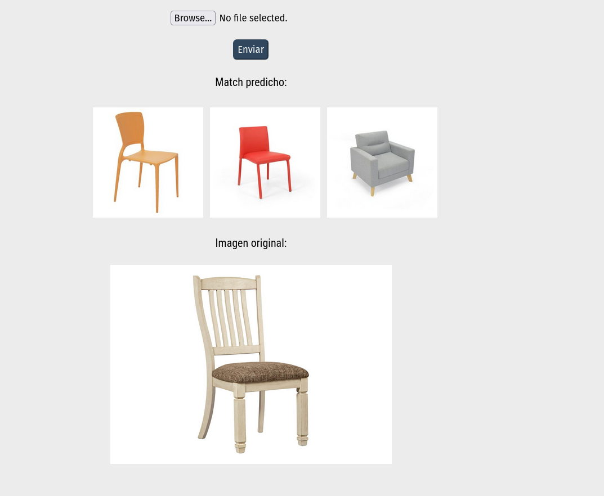

# DenseNet Image Similarity 

Flask web application that takes an image, and displays the three most similar images to the one uploaded 

## Project structure 

The project is composed of two main folders:

- `redcnn` houses the REST based API that calculates the feature vector of the uploaded image using a pretrained DenseNet CNN. 

- `buscador` contains HTML and CSS files for the visual part of the application. This part of the project is also responsible for taking in an image, and sending it to the REST API with a POST request, to find the three most similar images to the one uploaded. Once the app receives the feature vector from the API, it compares the vector to hundreds of precalculated feature vectors for other images in the training set, and finds the three most similar images using Euclidean distance. After the three feature vectors are calculated, their corresponding images are displayed.
